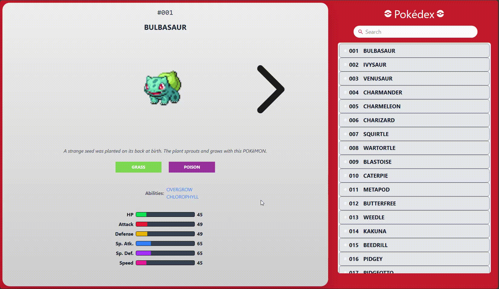

# Pokédex (HTML5 & JavaScript)

## Description

Pokédex is a web application that allows users to browse and view details of the first 151 Pokémon. It is built using HTML5, JavaScript, and Tailwind CSS for styling. The application fetches data from the PokéAPI to display various details, including Pokémon types, abilities, and stats. The user can navigate through Pokémon using arrows, search for specific Pokémon, and toggle between normal and shiny sprites.

## Demo

<p align="center">
  
</p>

## Getting Started

### Dependencies:

- **Web Browser**: A modern web browser (Google Chrome, Mozilla Firefox, etc.) is required to use the application.
- **Internet Connection**: Required to fetch Pokémon data from the PokéAPI.

### Executing Program:

1. Clone the repository:

   ```bash
   git clone https://github.com/your-username/pokedex.git
   cd pokedex
   ```

2. Open `index.html` in your browser:

   ```bash
   open index.html   # For macOS
   start index.html  # For Windows
   ```

## Features

- **PokéAPI Integration**: Fetches Pokémon data dynamically from the PokéAPI.
- **Search Functionality**: Allows users to search for Pokémon by name or ID.
- **Navigation Arrows**: Users can navigate between Pokémon using left and right arrows.
- **Shiny Sprite Toggle**: Clicking on a Pokémon image toggles between normal and shiny sprites.
- **Detailed Stats & Abilities**: Displays Pokémon stats, abilities, and descriptions.
- **Responsive UI**: Built with Tailwind CSS for a smooth and responsive user experience.

## Roadmap

- Add support for all generations of Pokémon.
- Implement a favourites system to save selected Pokémon.
  - Click on the ball.
  - Make a search filter for favourites.
- Enhance UI with animations and transitions.
- Make on-hover effects.
- Scroll bar to be discrete.
- Change how the information is loaded.
	- Upon clicking right or left.
	- Should load up all information first before updating page.
	- Spinning Pokéball as we wait for things to load.
- Dark Mode:
	- Light Mode (Solrock as the button for the icon)
	- Dark Mode (Lunatone as the button for the icon)

## License

This project is licensed under the MIT License - see the [LICENSE.md](LICENSE.md) file for details.

## Acknowledgments

- Data provided by [PokéAPI](https://pokeapi.co/).
- Inspired by the original Pokédex from Pokémon games.
- Thanks to open-source contributors for resources and guidance.

